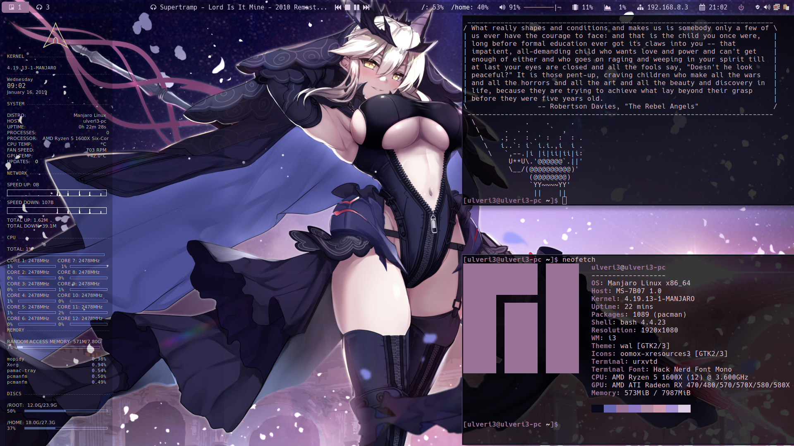

# i3wmDots

My personal dotfiles for i3wm and sundry apps, terribly formatted at the moment as I've rushed through. Will change as time allows. Used on Manjaro i3wm so your mileage may vary on other distro's.

# Applications Needed
-i3wm gapps (Obviously)

-ncmpcpp with mopidy and mopidy-spotify (visualizer works but is a hackjob)

-ranger

-conky (Slightly modified from another source)

-Polybar

-Pywal(love this #$#!ing app)

-wpgtk

-dunst (Create a symlink from the /.cache/Wal/dunstrc to the dunst config folder for theming to work

-nitrogen (for wallpapers, you can also use feh but i3 config will need to be edited)

-urxvt

Note that I predominantly use Hack Nerd Font so please make sure that is installed or
adjust accordingy

