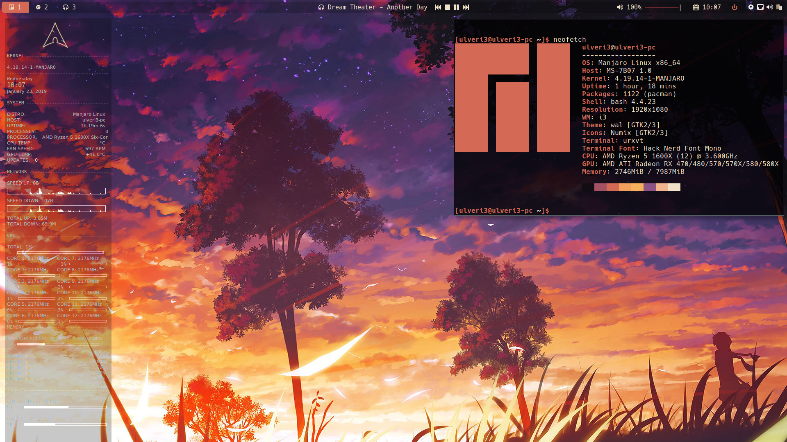

# i3wmDots

My personal dotfiles for i3wm and sundry apps, terribly formatted at the moment as I've rushed through. Will change as time allows. Used on Manjaro i3wm so your mileage may vary on other distro's. (Although any arch based distro SHOULD work)

# Applications Needed
-i3wm gapps (Obviously)

-ncmpcpp with mopidy and mopidy-spotify (visualizer works but is a hackjob)

-ranger

-conky (If you want to use my config, needs to be symlinked from wal's template folder, also radeontop is a dependency)

-Polybar

-Pywal(By far the most important, I love this app)

-wpgtk (Needed to theme gtk via pywal schemes)

-dunst (Create a symlink from the /.cache/Wal/dunstrc to the dunst config folder for theming to work

-nitrogen (for wallpapers, you can also use feh but i3 config will need to be edited)

-urxvt

-Bash-it

-Yay (not needed but manually building everythings a pain )

-lx-appearance (Not strictly needed but makes config abit easier)

-Rofi

-Playerctl

Note that I predominantly use Hack Nerd Font so please make sure that is installed or
adjust accordingly (Install nerd-fonts-complete off aur)

